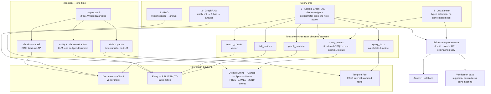
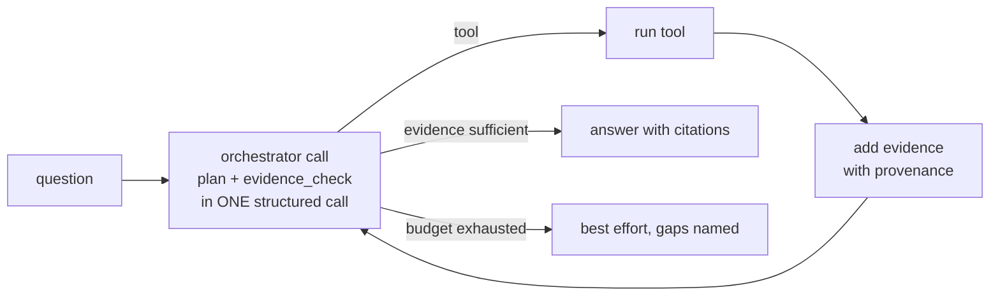
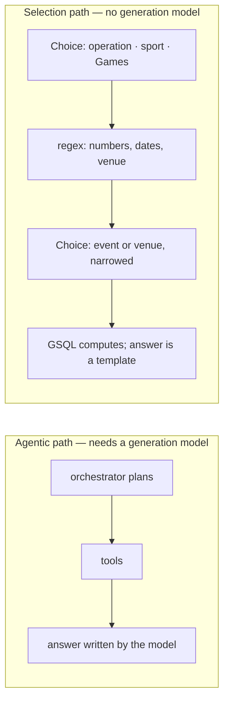

# Architecture

## System

## How the agent decides a step

The self-evaluation rides in the same call as the routing decision, so
evaluating the evidence costs no extra LLM call. Measured over 100 questions:
2.04 steps, and all 100 investigations stopped because the agent judged the
evidence sufficient, never because it hit the iteration cap.

## The two answer paths, and why both exist

Both reach 99/100. The agentic path generalises to anything in the corpus; the
selection path is 10x faster, makes no generation calls, and therefore cannot
fail on a rate limit — which is the difference between a demo that runs and one
that dies on stage.
